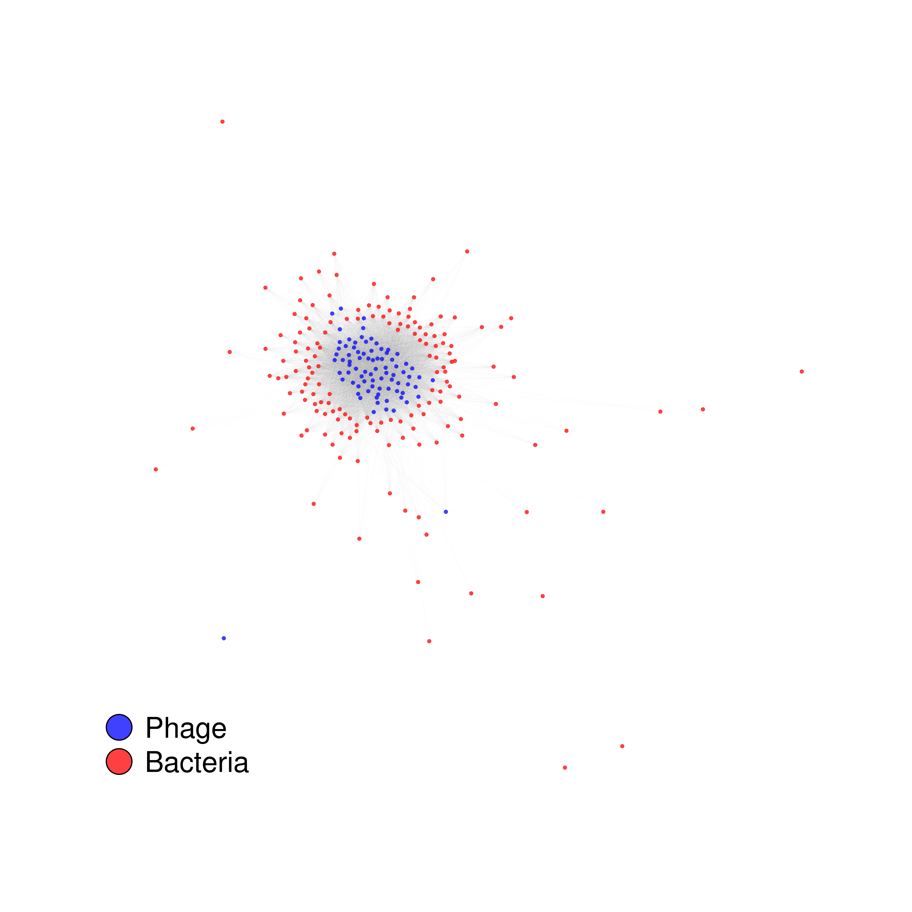
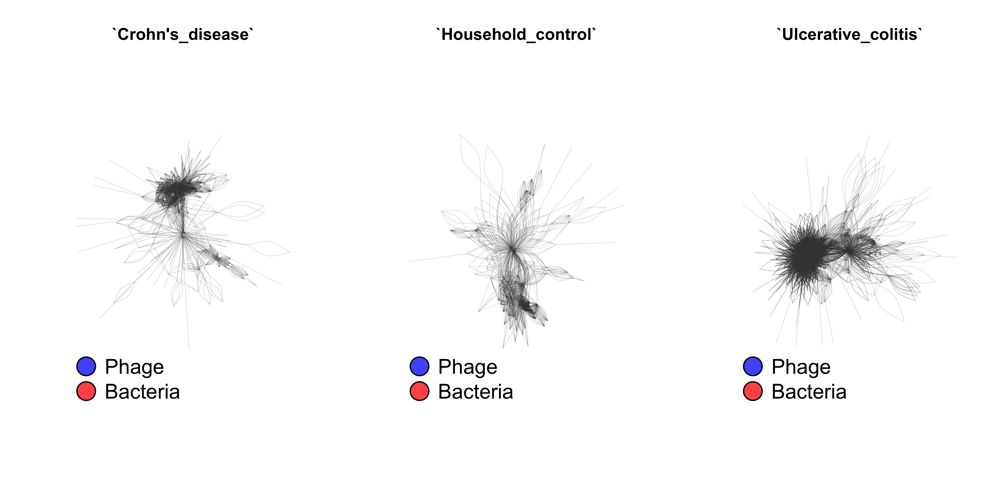

\newpage

# Abstract
Here we present a global view of phage-bacteria interactions across the human virome. We present our model for phage-bacteria interactions with validation for accuracy and sampling coverage. These networks are valuable because they do not rely on the sub-optimal reference genome datasets, and provide a more accurate view of the relationships within the community. We find that interactive dynamics are associated with disease states and anatomical body sites, using a global virome meta-analysis dataset. Our comprehensive approach to understanding the virome provide new insights not only inro composition and diversity, but their context in the greater community. We find that disease states and anatomical sites are not only linked to altered community composition and diversity, but also represent significant shifts in interactive dynamics.

# Introduction
Predator-prey interactions are one of the fundamental pillars to an ecosystem's persistence, diversity, and functionality [@Poisot071993;@Thompson:2012ki]. This is particularily evident in the predator-prey dynamics of bacteria and bacteriophage (bacterial virus) communities. Because phages are incapable of their own metabolic processes, they rely on bacteria as reproductive vessels and functional conduits without which they cannot act or persist. Although bacteria are metabolically capable, their evolution and community stability depend on bacteriophage predation and transduction (phage mediated gene transfer). Together these communities are capable of stable persistence in a mutually beneficial relationship.

Despite the mutual dependence of phage and bacteria communities, they are often studied in isolation. This is especially true for the human virome and microbiome. The majority of microbiome studies to date have focused exclusively on bacterial community composition and diversity, largely due to technical limitations. Some studies of the human virome have analyzed the bacterial communities in parallel, but often using cursory techniques. Here we present the use network analyses across a global human virome dataset to understand the ecological network signatures associated with disease states.

By understanding the signatures of the interacting communities, we are able to gain new insights into the biology of these systems. The ecological networks can be used to assess community stability and fragility, and components of that network can be used to assess the specific microbial players in that stability. We also know that these networks can be impacted by environmental factors such as resource availability [@Poisot:2011jc].

Until recently, a global human virome analysis has been largely infeasible. Recent advances in sequencing technology and virus purification techinques have allowed for an influx of paired virome and bacterial metagenomic data that have begun to power meta-analysis capabilities.

# Results
## The Global Human Virome Dataset
We leveraged the extensive public sequence archives to assemble a **global human virome** dataset; a robust human virus community metagenomic dataset that spans diverse body site environments. Dataset sampling includes the gut, oral cavity, skin, and urinary tract systems, all of which are associated with healthy and disease states, and were all collected by multiple, independent groups. By working only with virome datasets that were purified for virus like particles (VLPs), we are able to establish confiendence that we are detecting the *active* virome component. The resulting dataset contains data from ten virus metagenomic studies [@Norman:2015kb;@Monaco:2016it;@Minot:2011ez;@Hannigan:2015fz;@Modi:2013fi;@Ly:2014ew;@Abeles:2015dy;@Reyes:2010cw;@SantiagoRodriguez:2015gd;@Lim:2015bq].

<!--
- Number of sequences and samples.
- Gender and geographic distributions.
- Diseases included in the studies
- I need to finish metadata information
-->

## Sampling Depth and Dataset Validity
Because the virome sequence space is dominated by unknown and poorly annotated genomes, we focused on the Operational Protein Families (OPFs) within the assembled contigs of the dataset. Operational protein families are functionally similar to operational taxonomic units, in that they are groups of open reading frames with similar nucleotide sequences. Here I also need to make sure I outline why core OPFs are important.

We began by assessing the current progress in sampling the human virome OPF space. A rarefaction analysis revealed that virome OPFs can be sufficiently covered in a single study, however the average sequencing depth to achieve such coverage is relatively high at approximately 10 million sequences **(Figure \ref{OpfRarefaction} A)**. We quantified the rarity of the OPFs by showing that the majority of OPFs only had sequence counts between 10-1000 **(Figure \ref{OpfRarefaction} B)**. These results provide important information that inform both the technical and biological aspect of the human virome. Technically, the general sequencing depth for a human virome study should be approximately 10 million sequences. At this point the majority of OPFs have been sampled. Biologically, this lends confidence to our current understanding of the virome because we are able to sample the majority of virome operational protein families.

We investigated the core and pan viromes by calculating the shared distribution of phage OPFs across the samples. As expected, the core virome tapers off rapidly as the sequencing depth increases. Individual body sites harbor different core viromes. The majority of the core genes were housekeeping and structural genes, however we did identify some auxiliary metabolic genes throughout the human virome. Auxiliary metabolic genes are phage-encoded genes that convey a bacterial or eukaryotic function. These genes represent the tools that phages use to manipulate their bacterial host population functionality.

<!--
Here I will want to add rarefaction for the number of contigs I am getting as I add samples. Even more importantly I want to add rarefaction of how many circular genomes I can complete as I add sequences. I expect to hit a plateu with both of these.
-->

## Modeling Phage-Bacteria Interactions Across the Human Virome
We used Neo4J graph database software to construct a network of predicted interactions between bacteria and bacteriophages. Results from a variety of complementary interaction prediction approaches were layered into a single network **(Figure 1)**. *In vitro*, experimentally validated interactive relationships were taken from the existing literature. Clustered Regularly Inter-spaced Short Palindromic Repeats (CRISPRs) are a sort of bacterial adaptive immune system that serves as a genomic record of phage infections by preserving genomic content from the infectious phage genome. These records were used to predict infectious relationships between bacteria and phages. Infectious relationships were also predicted by identifying expected protein-protein interactions and known interacting protein domains between phages and their bacterial hosts. We finally used nucleotide blast to identify genomic similarity between bacteriophage genomes and sections of bacterial genomes. Such a match is a good predictor of an interaction between the phage and it's bacterial host.

We validated our predictive graph model by quantifying the sensitivity and specificity using a manually curated dataset of experimentally validated positive and negative interactions. Experimental results were extracted from manuscripts published between 1992 and 2015 **(Figure \ref{BenchmarkHeat})** [@Jensen:1998vh;@Malki:2015tm;@Schwarzer:2012ez;@Kim:2012dh;@Matsuzaki:1992gw;@Edwards:2015iz]. This allowed us to both evaluate the utility of the model, as well as determine the optimal decision thresholds to use for predictions.

The resulting model had an AUC of 0.651, an optimal sensitivity of 0.872, and an associated optimal specificity of 0.517 **(Figure \ref{roccurve})**. We are therefore able to effectively avoid false positive interactions, while at the same time detecting the minimum amount of interactions within the system.

<!--
- Update ROC curve to include species and genus level IDs.
- Update ROC to include predictive power of each individual method
-->

## Interactive Dynamics Are Associated with Anatomical Sites
Phages are known to transfer genetic content between bacteria in the process of transduction. This has great medical importance when considering transduction of antibiotic resistance genes and other virulence factors. In a dense microbial community, transduction is likely to play an important role in bacterial fitness and virulence. To date, we have a minimal understanding of the interactions phages are facilitating between bacteria. Furthermore, the roles of broadly infecting phages have yet to be considered. Our graph approach allows us to begin predicting and understanding these interactions.

We predicted the phage-mediated relationships between bacteria by executing triadic closures as (bacteria)-[phage]->[bacteria]. Triadic closure theory states that a strong relationship of two entities to a shared intermediate suggests a relationship between the two previously unrelated entities. In our case, we are assigning relationships between bacteria based on shared strong relationships to a phage intermediate.

One of the most powerful aspects of this analysis is that it allows us to evaluate the global interactive properties of the interactive networks across the body and thus provide insight into the complex ecological dynamics. We found that the phage-bacteria interactive network follows a scale-free distribution instead of a random exponential distribution. Not only does this indicate a lack of randomness in the population, it also suggests the hub is composed of hubs that are highly interconnected to the remaining nodes.

## Disease States Drive Altered Interactive Network Dynamics
The virome has been associated with a variety of disease states across many body sites. Because many of the virome samples within our global virome dataset were associated with diseases, we were able to identify and confirm global virome trends in the human virome. We found that the diversity of disease samples was impacted by the body site. Despite the disease, the body site contributed to the virome diversity signature.

Here I want to get at the fact that at first, given a stable bacterial reference, the interactive dynamics of the networks differ between disease and healthy states.

I can use eccentricity centrality to define the most central microbial nodes of the complex graph.

The diameter of the network is short, suggesting a small-world distribution. Because it follows a scale-free distribution, it is also protected from random attack, but highly susceptible when hub nodes are impacted. I will need to expand on this later.

<!--
- Include general changes in centrality, as well as the specific phages and bacteria assocaited with highest centrality.
- Look at the network both with bacteria from the metagenomes, as well as the reference bacteria. References are valuable because they take the bacterial variability out of the picture.
-->

# Discussion
An application that we alluded to here is a graphical approach to microbiome research in general. 

# Materials & Methods

\newpage

# Figures

\newpage

\newpage

\newpage

\newpage

\newpage

\newpage

\newpage

\newpage

\newpage
# Bibliography
